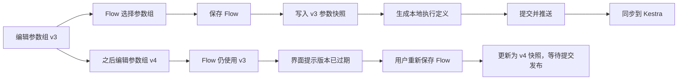

# 参数组 V1 设计

> 状态：参数组基础链路已经实现；Flow 运行时区与参数快照 schema v2 已落地
>
> 最后核对：2026-09-11
>
> 适用范围：参数组管理、离线 Flow 绑定、SQL 节点参数化、手动与调度执行

本文档是参数组 V1 的实现依据。领域词义以根目录 [`CONTEXT.md`](../CONTEXT.md) 为准；如果实现改变了本文约定，应在同一个变更中更新本文档，避免设计文档与代码再次脱节。

## 1. 目标

V1 要解决四件事：

1. 用户可以在项目组内创建和维护可复用的参数组。
2. 一个 Flow 可以按顺序绑定多个参数组，并在 SQL 节点中通过命名参数引用合并后的参数。
3. 固定参数和显式选择时间基准的时间参数都能得到确定、可解释的字符串值。
4. 已发布 Flow 不会因参数组后来被修改而静默改变行为。

示例：参数 `xxx` 的字符串值保存为 `小明`，SQL 写成：

```sql
select *
from user
where name = ${xxx}
```

执行时由 WB-Data 的 Kestra JDBC 任务把占位符编译为 `?`，再由 `PreparedStatement` 绑定字符串值，而不是把 `'小明'` 拼接进 SQL。目标数据库负责按自己的规则进行隐式转换；开发者需要严格类型时，应在 SQL 中显式写 `CAST(${key} AS ...)`。

## 2. 已确认的产品决策

| 主题 | V1 决策 |
| --- | --- |
| 作用域 | 参数组属于项目组，不跨项目组共享 |
| 绑定粒度 | 一个 Flow 可以按顺序绑定多个参数组，不做节点级绑定；列表越靠前优先级越高，靠后参数组中的同名定义被覆盖 |
| 可见范围 | Flow 内全部节点可见同一组参数；V1 只允许 SQL 节点消费参数 |
| 更新语义 | 参数组修改后不自动改变已保存或已发布 Flow |
| 生效动作 | 用户重新保存 Flow 时绑定当前版本并重新生成文件；提交、推送并同步后才影响 Kestra |
| 发布记录 | Flow 保存参数组代码、版本和完整定义快照 |
| 参数值 | V1 全部是字符串，不在 WB-Data 中维护整数、布尔、日期等类型 |
| 时间基准 | 每个时间参数显式选择计划时间或执行开始时间，不允许自动回退 |
| 运行时区 | 由 Flow 唯一提供，调度与时间参数共享；参数组不保存时区 |
| 手动计划时间 | Flow 定义了计划时间参数时，手动执行必须提供本次执行的模拟计划时间；不解析所选节点内容判断是否使用 |
| 手动覆盖 | 手动执行可以覆盖已有参数，且只影响该次执行 |
| SQL 语法 | 使用裸 `${key}`；占位符不能放在单引号、双引号或反引号内 |
| 密钥 | 不校验、不拦截：用户填写什么就保存什么；参数值明文进入 Git 快照，敏感值由用户自行负责 |

参数组绑定数组的顺序就是覆盖优先级：索引 `0` 是最高优先级。合并时保留最先出现的参数定义，后续参数组只补充尚未定义的参数键。调整列表顺序会改变同名参数的最终定义，并随下一次保存 Flow 写入参数快照。

## 3. V1 边界

V1 明确不做：

- 节点级参数组绑定和复杂的自定义优先级规则。
- 参数引用另一个参数、任意表达式或脚本求值。
- 参数类型选择和 WB-Data 侧的数据库类型推断。
- Secret 管理；秘密应继续由专用凭据机制管理。
- `null` 参数值。
- 列表、数组以及 `IN (${ids})` 自动展开。
- 用参数替换表名、列名、运算符、排序表达式或任意 SQL 片段。
- 节点级参数组和节点私有参数。
- Shell、Hive SQL、传输节点中的参数替换。
- 参数组修改后自动批量发布所有引用它的 Flow。

这些限制不是底层模型的永久能力边界，而是为了先建立清楚、可测试的语义。

## 4. 参数模型

### 4.1 参数组

参数组包含：

- `id`：数据库主键，只用于当前环境 API。
- `groupId`：所属项目组。
- `code`：项目组内唯一、创建后不可修改的稳定代码，用于 Git 快照和跨环境识别。
- `name`、`description`：展示信息。
- `version`：从 1 开始的定义版本。
- `status`：`ACTIVE` 或 `ARCHIVED`。
- 创建人、更新人和审计时间。

修改参数定义会递增 `version`；只修改参数组名称或描述不递增版本。归档不会删除历史快照，也不改变版本。

### 4.2 参数定义

每条参数定义包含：

- `key`：匹配 `[A-Za-z][A-Za-z0-9_]{0,63}`，区分大小写；`wbdata_` 前缀保留给系统。
- `valueSource`：`CONSTANT` 或 `SYSTEM_TIME`。
- `description`、`sortOrder`。
- 与取值来源对应的配置。

所有参数值都是字符串。常量只存储原始值，不添加 SQL 引号，例如保存 `小明`，SQL 写 `name = ${name}`。空字符串 `""` 是合法值，必须与字段缺失区分；V1 不支持 `null`。

时间参数包含：

- `timeBasis`：必填，`PLANNED_TIME` 或 `EXECUTION_START_TIME`。
- `offsetDays`：整数，默认 `0`。
- `format`：必填，例如 `yyyyMMdd` 或 `yyyy-MM-dd HH:mm:ss`。

时间参数不保存时区。解析时统一使用绑定 Flow 的运行时区，按下面的固定顺序计算：

1. 从执行时间上下文中取得所选时间基准。
2. 转换到 Flow 运行时区。
3. 在该时区按日历日应用 `offsetDays`，不是简单增加或减少固定 24 小时。
4. 按 `format` 输出字符串。

两种时间基准的含义：

| 时间基准 | 含义 | 历史实例在 2026-08-01 重跑时 |
| --- | --- | --- |
| `PLANNED_TIME` | 调度器原计划触发本次执行的时间 | 沿用原计划时间，例如仍为 2026-01-01 02:00 |
| `EXECUTION_START_TIME` | Kestra 真正开始本次 Flow Execution 的时间 | 使用新执行的开始时间，例如 2026-08-01 |

### 4.3 执行时间上下文

每次执行只有一份不可变时间上下文：

```json
{
  "plannedTime": "2026-01-01T02:00:00+08:00",
  "executionStartTime": "2026-01-02T05:00:00+08:00",
  "runtimeTimezone": "Asia/Shanghai"
}
```

- `plannedTime` 可空；只有调度执行、历史重跑或用户提供模拟计划时间时才存在。
- `executionStartTime` 在 Kestra 真正开始该 Flow 执行时确定，整次执行和所有节点共用，不能取节点开始时间、按钮点击时间或解析时的 `now()`。
- `runtimeTimezone` 来自 Flow。即使 Flow 未启用调度，也必须有明确的运行时区。
- 浏览器、后端 JVM、Kestra 和容器的默认时区都不能作为静默回退值。

### 4.4 解析示例

假设 Flow 运行时区为 `Asia/Shanghai`，计划时间是 `2026-01-01 02:00:00`，因上游延误，执行开始时间是 `2026-01-02 05:00:00`：

| 参数键 | 定义 | 最终字符串值 |
| --- | --- | --- |
| `user_name` | 固定值 `小明` | `小明` |
| `v_plan_day` | 计划时间，`yyyyMMdd`，偏移 0 天 | `20260101` |
| `v_prev_plan_day` | 计划时间，`yyyyMMdd`，偏移 -1 天 | `20251231` |
| `v_start_day` | 执行开始时间，`yyyyMMdd`，偏移 0 天 | `20260102` |

SQL 模板：

```sql
select *
from user_event
where name = ${user_name}
  and plan_day = ${v_plan_day}
  and actual_day = ${v_start_day}
```

JDBC 收到 SQL 模板和参数映射：

```json
{
  "user_name": "小明",
  "v_plan_day": "20260101",
  "v_start_day": "20260102"
}
```

WB-Data 不生成字符串拼接后的“最终 SQL”。目标数据库如何把这些字符串与字段类型比较，由 SQL 写法和数据库规则决定。

## 5. 生命周期与版本



关键规则：

- 参数组更新与 Flow 发布是两个独立动作，不做隐式级联。
- 保存只更新工作区中的 Flow、参数快照和生成文件；沿用现有提交 → 推送 → Git 事件 → Kestra 同步链路发布。
- Flow 读取时比较快照版本与数据库当前版本，显示 `CURRENT`、`OUTDATED`、`ARCHIVED` 或 `MISSING`。
- `ARCHIVED` 参数组不能被新 Flow 绑定，也不能用它的当前定义重新发布；已有快照仍可执行。
- 参数组不提供物理删除接口。归档是默认的生命周期终点。
- 参数键改名按“删除旧键、增加新键”处理，是破坏性变更；管理界面保存前列出被移除的旧键，并说明已有 Flow 快照不变、升级前需要修改引用。
- `version` 只表示参数定义版本：只有规范化后的定义变化时才递增，供 Flow 快照判断是否过期。
- `revision` 表示并发修订号：名称、说明、定义、归档状态等任何实际修改都会递增；更新请求带 `expectedRevision`，后端用它拒绝覆盖其他用户的新修改。

## 6. 持久化设计

### 6.1 数据库

新增两张表：

`wb_parameter_group`

| 字段 | 约束或说明 |
| --- | --- |
| `id` | `BIGINT` 自增主键 |
| `group_id` | 外键到 `wb_project_group.id` |
| `code` | `VARCHAR(64)`，项目组内唯一，不可修改 |
| `name` | `VARCHAR(100)` |
| `description` | `VARCHAR(500)`，可空 |
| `version` | `INT NOT NULL DEFAULT 1`，参数定义版本 |
| `revision` | `INT NOT NULL DEFAULT 1`，每次实际修改递增的并发修订号 |
| `status` | `VARCHAR(16)`，`ACTIVE` / `ARCHIVED` |
| 审计字段 | `created_by`、`updated_by`、`created_at`、`updated_at` |

`wb_parameter_definition`

| 字段 | 约束或说明 |
| --- | --- |
| `id` | `BIGINT` 自增主键 |
| `parameter_group_id` | 外键到参数组 |
| `parameter_key` | `VARCHAR(64)`，组内唯一 |
| `value_source` | `VARCHAR(16)` |
| `constant_value` | `TEXT`，仅常量使用 |
| `time_basis` | `VARCHAR(32)`，仅时间参数使用 |
| `value_format` | `VARCHAR(64)`，仅时间参数使用；API 字段为 `format` |
| `offset_days` | `INT NOT NULL DEFAULT 0` |
| `description` | `VARCHAR(255)`，可空 |
| `sort_order` | `INT NOT NULL DEFAULT 0` |
| 审计字段 | `created_at`、`updated_at` |

参数组与定义作为一个聚合保存：一次事务中校验完整请求并替换定义列表；规范化后的定义内容实际变化时才递增 `version`，任何实际修改都递增 `revision`。数据库保存“当前版本”，不承担已发布历史版本库的职责。

### 6.2 Flow 的 Git 快照

每个 Flow 目录在 `.layout.json` 旁新增 `.parameters.json`。文件由系统管理并进入 Git，例如：

```json
{
  "schemaVersion": 2,
  "runtimeTimezone": "Asia/Shanghai",
  "groupCode": "daily_common",
  "groupVersion": 3,
  "definitions": [
    {
      "key": "xxx",
      "valueSource": "CONSTANT",
      "constantValue": "小明"
    },
    {
      "key": "v_day",
      "valueSource": "SYSTEM_TIME",
      "timeBasis": "PLANNED_TIME",
      "format": "yyyyMMdd",
      "offsetDays": 0
    }
  ]
}
```

快照不写数据库主键、保存时间和保存人，避免跨环境耦合及无意义 Git diff。快照必须包含构建执行定义所需的全部信息。

系统只写 schema v2。读取旧 schema v1 时，会从旧定义中的参数级时区恢复 Flow 运行时区；下次保存 Flow 时统一升级为 v2 并删除 `dataType`、`timezone`、`offsetAmount` 和 `offsetUnit` 等旧字段。无法确定运行时区时禁止保存，不使用浏览器、JVM 或 `Asia/Shanghai` 作为静默回退。

Flow 保存逻辑需要把 `.parameters.json` 纳入受管文件集合。解除绑定时删除该 sidecar，并从生成的执行定义中移除对应输入与绑定。

数据库与 Git 的职责如下：

| 数据 | 权威来源 |
| --- | --- |
| 参数组当前定义、状态、管理列表 | 数据库 |
| 已保存 Flow 实际绑定的版本和内容 | Git 中的参数快照 |
| Flow 运行时区 | Flow 定义；调度启用时与 Schedule timezone 使用同一个值 |
| Kestra 可执行定义 | 由 Flow 文件和参数快照编译生成 |

现有数据库列 `data_type`、参数级 `timezone`、`offset_amount` 和 `offset_unit` 属于旧模型。实现新模型时必须用新的 Flyway migration 做兼容迁移，不能直接修改已经执行过的 V14；迁移完成前保留旧列只作为兼容数据，业务代码不再把它们作为权威语义。

## 7. API 契约

### 7.1 参数组管理

基础路径：`/api/v1/groups/{groupId}/parameter-groups`

| 方法 | 路径 | 用途 |
| --- | --- | --- |
| `GET` | `/` | 分页、按名称或代码搜索 |
| `POST` | `/` | 创建完整参数组 |
| `GET` | `/{id}` | 读取组和全部定义 |
| `PUT` | `/{id}` | 带 `expectedRevision` 替换完整聚合 |
| `POST` | `/{id}/archive` | 归档 |
| `POST` | `/{id}/restore` | 恢复为可绑定状态 |
| `POST` | `/{id}/preview` | 按显式执行时间上下文预览解析结果 |

继续沿用项目组授权模型。V1 新增 `parameter.read` 和 `parameter.write`；开发者拥有两者，项目组管理员和系统管理员拥有全部权限。

预览接口只做纯计算，不创建执行。存在时间参数时，请求必须显式提供 `runtimeTimezone`；包含执行开始时间参数时提供 `executionStartTime`，包含计划时间参数时提供 `plannedTime`。每个非空本地时间必须在该运行时区中恰好对应一个 UTC 偏移；夏令时切换造成的不存在或不唯一时间一律拒绝，不能静默调整或默认选择偏移。响应返回最终字符串值、来源、时间基准和计算过程。独立参数组页面没有 Flow 上下文，打开窗口时只加载定义和展示固定值，不自动借用浏览器时区或当前时间；用户明确填写上下文并点击“计算预览”后才计算时间参数。“使用浏览器当前时间与时区”只能作为用户主动触发的快捷操作。

### 7.2 Flow 保存与读取

`SaveOfflineFlowDocumentRequest` 增加：

```json
{
  "runtimeTimezone": "Asia/Shanghai",
  "parameterBinding": {
    "parameterGroupId": 12,
    "expectedVersion": 3
  }
}
```

后端不能相信前端传来的参数定义。保存时按 `parameterGroupId` 读取数据库聚合，校验项目组归属、状态和版本，再创建快照。

`runtimeTimezone` 是 Flow 创建时确定的不可变属性，不随调度开关删除。调度配置界面只读展示这个 Flow 运行时区；启用 Schedule 时将同一个值写入 Kestra trigger，禁用 Schedule 后仍保留它供时间参数和手动执行使用。后端必须拒绝通过 Flow 保存或调度接口修改已有 Flow 的运行时区。

为兼容尚未接入参数管理界面的客户端，保存请求采用三态语义：省略 `parameterBinding` 或传 `null` 时保持现有快照不变；传 `{}` 时解除绑定并删除 `.parameters.json`；传完整的 `parameterGroupId` 和 `expectedVersion` 时绑定或升级到指定当前版本。

Flow 读取响应增加：

```json
{
  "parameterBinding": {
    "parameterGroupId": 12,
    "code": "daily_common",
    "name": "每日公共参数",
    "boundVersion": 3,
    "currentVersion": 4,
    "status": "OUTDATED",
    "definitions": []
  }
}
```

如果当前环境找不到同代码的参数组，`parameterGroupId` 和 `currentVersion` 可以为 `null`，状态为 `MISSING`；快照仍是读取和构建已保存 Flow 的依据。

### 7.3 手动执行

调试执行请求增加：

```json
{
  "parameterOverrides": {
    "xxx": "李雷",
    "v_day": "20260815"
  }
}
```

覆盖规则：

1. 键必须已经存在于 Flow 参数快照。
2. 值必须是字符串；空字符串允许，`null` 不允许。
3. 本次手动覆盖优先于快照默认值。
4. 覆盖不写回参数组或 Git。
5. 执行详情返回 WB-Data 解析后的最终参数值及来源，不能直接把 Kestra `execution.inputs` 当作最终 SQL 参数。

`KestraClient` 的创建执行能力应从无输入扩展为显式输入映射。新建手动执行时：

- Flow 没有定义计划时间参数：不额外询问计划时间。
- Flow 定义了计划时间参数：不解析所选节点内容，执行前统一填写一个执行级“模拟计划时间”，供本次执行内全部计划时间参数共用。
- 缺少必需的模拟计划时间时阻止执行，不能回退到执行开始时间。

重试与重跑必须区分：

- 同一 Execution 内的节点重试复用原执行时间上下文和已解析参数集。
- 历史 Execution 重跑会创建新 Execution：沿用原计划时间，重新取得本次执行开始时间，再按当前 Flow 参数快照和每个参数的时间基准重新解析。
- 重跑不能无条件复用历史“完整已解析参数集”，否则基于执行开始时间的参数会错误地保持旧值。
- 原执行的手动覆盖应在重跑确认界面明确展示；只有用户确认后才沿用，不能静默继承。沿用的覆盖键必须在当前 Flow 参数快照中仍然存在，否则拒绝。
- 原执行之后 Flow 的参数快照可能已变化：重跑按当前快照执行，详情接口通过 `parameterSnapshotChanged` 告知前端；确认窗口显示提醒但不阻止，由用户决定是否用当前参数值继续。

历史执行的详情展示不能用 Flow 当前绑定的快照重新解释。保存或编译 Flow 时，后端会把不可变参数快照登记到 `wb_execution_parameter_snapshot`，并将内容哈希写入 Flow label `wbdataParameterSnapshotId`。Flow 创建时确定的运行时区也保存在这份不可变参数快照中；计划时间来自 Kestra `plannedAt` 或系统保留 input `wbdata_planned_time`，执行开始时间来自该 Execution 的 `startDate`，手动覆盖键和值保存在执行 label 与 inputs 中。详情按这些历史事实重新解释参数；重跑则以当前 Flow 快照为准、沿用历史计划时间创建新的执行时间上下文。参数组后续修改不会改写历史结果。

运维中心重跑接口 `POST /api/v1/groups/{groupId}/operations/executions/{executionId}/rerun` 必须接收显式请求体：

```json
{
  "reuseManualOverrides": false
}
```

`false` 是界面默认值，表示不继承原执行的手动覆盖；只有用户在确认窗口勾选后才发送 `true`。无论是否沿用手动覆盖，只要 Flow 定义了计划时间参数，后端都会把原执行的计划时间传给新 Execution；新执行开始时间由 Kestra 在本次启动时重新记录。创建新 Execution 时，`KestraClient` 还会通过 Kestra 1.3.7 支持的执行级 `labels` 查询参数覆盖 `wbdataParameterOverrideKeys`：确认沿用时写入原覆盖键，不沿用时写入内部空标记，避免 Flow 原有 label 让新执行详情误判覆盖来源。

## 8. 编译与执行设计

### 8.1 模块边界

建议形成三个清晰接口：

1. `ParameterGroupService`：参数组聚合的查询、校验、版本化更新和归档。
2. `FlowParameterSnapshotStore`：只负责 `.parameters.json` 的读、写、删除和 schema 兼容。
3. `FlowParameterCompiler`：把不可变快照编译成 Flow 输入和节点运行时参数绑定；它不访问数据库或 Git。

现有 `OfflineNodeTaskCompiler` 只消费编译结果，不直接查询参数组。后续若编译上下文继续增加，应引入单一 `NodeCompilationContext`，避免在四类节点编译器上不断追加参数。

参数解析的核心应保持纯函数：相同快照、时间上下文和覆盖值必须得到相同结果。这样可以直接做单元测试，也便于未来替换 Kestra 或增加预览能力。

### 8.2 SQL 节点

SQL 节点保留裸 `${key}`，编译后的 WB-Data Kestra JDBC task 使用 `parameters` 映射绑定：

```yaml
sql: "{{ read('scripts/query.sql') }}"
parameters: '{{ {"xxx": inputs.xxx, "v_plan_day": (inputs.v_plan_day ?? ((inputs.wbdata_planned_time ?? trigger.date) | date("yyyyMMdd", timeZone="Asia/Shanghai"))), "v_start_day": (inputs.v_start_day ?? (execution.startDate | date("yyyyMMdd", timeZone="Asia/Shanghai")))} | toJson }}'
```

`parameters` 把整个 map 一次性渲染为 JSON，再交给 JDBC 命名参数绑定。所有业务参数都是字符串；`wbdata_planned_time` 是系统保留的执行上下文输入，不是用户参数。

这里的 `inputs.wbdata_planned_time ?? trigger.date` 不是“计划时间回退到执行开始时间”：两者都表达计划时间。前者只用于手动模拟计划时间或历史重跑，后者来自真实 Schedule occurrence。两者都不存在时，参数保持待解析；WB-Data 发起的手动执行会在创建前阻止运行。

保存和调试前需要解析 SQL 中的命名参数并校验：

- SQL 引用了快照中不存在的键：错误，阻止保存或执行。
- 参数组中存在 SQL 未使用的键：正常情况，不告警、不阻止。
- 参数语法出现在注释中：不能误判为引用。
- 参数语法出现在字符串或标识符引号中：报错并提示移除引号。
- PostgreSQL `::type` 等方言语法：不能误判为命名参数。

因此不要用简单正则表达式扫描 SQL；当前实现使用词法状态扫描器，并覆盖引号、行/块注释、PostgreSQL dollar quote、`::type` 和非法参数键。

官方 Kestra JDBC 插件使用简单正则替换整个 SQL，会误伤字符串、注释和 `::type` 中的冒号。WB-Data 因此提供 `io.wbdata.kestra.jdbc.*.Query` 自定义任务；后端与任务共用同一个 SQL 模板模块，把真正的 `${key}` 编译为 `?` 和有序参数，再调用 `PreparedStatement.setObject`。普通字符串 `'a:tom,b:jack'`、注释中的冒号和 PostgreSQL `::type` 均原样保留。旧的裸 `:key` 写法不再被识别为参数，按普通文本原样传给数据库。

V1 的参数编译只处理 SQL 节点。Hive SQL、Shell 和传输节点保持原有脚本语义，界面不向这些节点提供参数插入入口；尤其不能把 Shell 自身的 `${VAR}` 环境变量误判为参数组引用。让各类节点都能消费参数是明确的后续方向（V2）：支持某类节点时，应为该节点明确定义语法和转义规则。

### 8.3 Kestra 映射

目标核心结构如下。现有 Kestra 1.3.7 和 MySQL JDBC 插件 1.9.2 已验证 inputs、表达式和 JDBC 参数绑定能力；新的双时间基准结构仍需重新执行完整回归：

```yaml
inputs:
  - id: xxx
    type: STRING
    defaults: 小明
  - id: v_day
    type: STRING
    required: false
  - id: wbdata_planned_time
    type: DATETIME
    required: false

triggers:
  - id: schedule
    type: io.kestra.plugin.core.trigger.Schedule
    cron: 0 0 * * *
    timezone: Asia/Shanghai

tasks:
  - id: query
    type: io.wbdata.kestra.jdbc.mysql.Query
    sql: "{{ read('scripts/query.sql') }}"
    parameters: '{{ {"xxx": inputs.xxx, "v_day": (inputs.v_day ?? ((inputs.wbdata_planned_time ?? trigger.date) | date("yyyyMMdd", timeZone="Asia/Shanghai")))} | toJson }}'
```

映射原则：

- 常量变成 `STRING` Flow input 默认值。
- 时间参数声明为可选 Flow input；手动覆盖通过 multipart 显式传入。
- 计划时间参数只读取 `trigger.date` 或系统保留的 `wbdata_planned_time`。
- 执行开始时间参数只读取 `execution.startDate`。
- 两种时间基准不相互回退；偏移按 Flow 运行时区的日历日计算后再格式化。
- 调度执行的时间 input 可以为 null，最终值存在于节点绑定语义中；运维详情需要结合参数快照和执行的 trigger/start 时间解析展示。

Kestra 1.3.7 实测表明，Schedule `inputs` 在创建执行前求值时无法访问本次 `trigger.date`，所以 V1 不采用“trigger 显式填充动态时间 input”的方式。

## 9. 校验和错误语义

校验按从早到晚分层：

| 阶段 | 典型校验 |
| --- | --- |
| 编辑参数组 | 键格式、键唯一、取值来源、时间基准、偏移天数和日期格式 |
| 保存 Flow | 参数组归属、状态、期望版本、SQL 引用完整性、节点类型支持 |
| 手动执行 | 覆盖键、字符串值、Flow 运行时区、必要的模拟计划时间、快照可解析性 |
| 调度执行 | 计划时间、Flow 运行时区和已发布快照完整性；异常进入执行日志和运维告警 |

错误信息必须包含 Flow、节点、参数键和失败原因。例如：

> SQL 节点“用户过滤”引用了未定义参数 `user_name`，请在参数组中新增该参数或修改 SQL。

参数值不得出现在普通应用日志中。错误信息可以显示参数键和来源，不能回显完整值。执行详情可以向有权限的用户展示 SQL 模板和参数映射，但不应伪造一条字符串拼接后的“最终 SQL”。

## 10. 前端交互

参数组作为项目组下独立的“参数管理”页面，而不是埋在项目组设置中。

### 参数管理页

- 列表显示名称、代码、版本、状态、参数数量和更新时间。
- 参数组代码由系统生成并在普通创建界面隐藏；名称是用户主要识别信息。
- 编辑页不提供数据类型选择。参数只选择“固定值”或“运行时日期”。
- 时间参数提供“计划时间 / 执行开始时间”、偏移天数和格式；不提供参数级时区。
- 固定值无需时间上下文即可展示；只有在用户明确选择 Flow 运行时区及定义所需时间并主动计算后，才显示时间参数示例。
- 归档前明确提示已有 Flow 快照仍可运行、但不能再绑定或升级到该组；恢复不改变版本。

### Flow 编辑页

- Flow 设置中选择或解除绑定参数组。
- Flow 始终保存一个创建时确定的运行时区；调度配置只读展示该值，关闭调度后不清空。
- 始终展示绑定版本；版本过期时显示明确提示和“更新到 vN”动作。
- 保存前展示缺失引用错误。
- SQL 编辑器提供可用参数列表和插入 `${key}` 的入口；自动补全可以后置，但不能改变语法。

### 执行前确认

- 展示本次解析后的参数值、来源和时间基准。
- Flow 绑定了参数时，手动执行统一进入参数设置；通过显式开关区分“不覆盖”和“覆盖为空字符串”。
- Flow 定义了计划时间参数时，显示且必填一个执行级“模拟计划时间”，默认按 Flow 运行时区预填当前时间，用户可以调整；否则不显示该字段，不解析节点内容判断是否使用。
- 重跑明确展示：原计划时间保持不变，本次执行开始时间将重新取得。
- 原执行之后参数快照已变化时，重跑确认窗口显示明显提醒但不阻止，用户确认后按当前 Flow 参数快照重跑。
- 原执行覆盖值单独展示并由用户确认是否沿用，不能描述成笼统的“复用原执行输入”。

## 11. 实施顺序

### 阶段 0：Kestra 能力验证和版本固定

当前容器固定为 Kestra OSS `v1.3.7`，本地实测时 MySQL JDBC 插件为 1.9.2。原有核心链路的证据见 [`research/kestra-parameter-capabilities.md`](research/kestra-parameter-capabilities.md)。

仓库已经在 `docker/docker-compose.kestra.yml` 中把兼容基线固定为精确版本 `v1.3.7`。官方当前候选 `v1.3.30` 的本地镜像导入未完成，因此尚未被 WB-Data 验证；不能直接替换基线。

核心 inputs、multipart、Schedule、时间表达式和 MySQL JDBC 参数绑定已在 1.3.7 通过。字符串单类型、双时间基准、模拟计划时间和新重跑语义仍需重新验证：

1. 补齐 SQL 字符串冒号、注释、PostgreSQL `::type`、时间边界和重跑用例。
2. 用 Java `KestraHttpClient` 回归 multipart 特殊字符编码和失败响应。
3. 记录精确镜像 digest 和插件版本，作为后续升级门禁。
4. 将来升级 v1.3.30 或更高版本时完整重跑能力矩阵。

实现方向为混合解析：固定值和手动覆盖使用 Kestra inputs，时间参数在节点运行上下文解析，SQL `${key}` 始终编译为 JDBC `?` 后绑定。字符串单类型不等于 SQL 文本替换，禁止退回字符串拼接 SQL。

### 阶段 1：参数组后端

- [x] Flyway migration、实体、Mapper 和聚合服务。
- [x] 参数模型校验、乐观锁和归档。
- [x] 管理、预览 API 与权限。
- [x] 聚合级单元测试。
- [x] MySQL 8 临时数据库迁移验证（完整执行 V1–V14，并校验参数键使用 `ascii_bin`）。
- [x] 新增兼容 migration：参数统一为字符串、时间参数增加 `timeBasis`、移除参数级时区语义。
- [x] MySQL 8 临时数据库验证 V16，并确认新定义默认写入 `STRING`、字符串 `007` 不丢失前导零。
- [x] 调整管理和预览 API，允许空字符串并接收显式执行时间上下文。

### 阶段 2：Flow 快照和编译

- [x] `.parameters.json` store 与 schema 校验。
- [x] Flow 保存/读取契约和 `CURRENT`、`OUTDATED`、`ARCHIVED`、`MISSING` 状态。
- [x] SQL 命名参数词法扫描、方言测试与 Kestra JDBC 不安全片段门禁。
- [x] `FlowParameterCompiler`、动态时间表达式和 JDBC 整体 `toJson` 参数映射的原始链路。
- [x] Git 受管文件、重命名、删除与并发文档签名链路。
- [x] Flow 持久化独立的运行时区，并让 Schedule 与参数解析共用。
- [x] 编译参数统一为字符串，并生成显式 `PLANNED_TIME` / `EXECUTION_START_TIME` 表达式。
- [x] 将 Flow 参数快照 schema 正式升级到新模型并清理兼容字段。

### 阶段 3：执行链路

- [x] 手动覆盖键和值的快照级校验原始链路。
- [x] `KestraClient` multipart inputs 和错误响应回传。
- [x] 执行详情展示 WB-Data 解析后的最终值与来源。
- [x] 调度执行按原 `plannedAt` 解析系统时间参数。
- [x] 原有重跑复用完整已解析参数的链路，作为历史行为保留测试证据。
- [x] 当前 Kestra 1.3.7 的保存产物 → 手动覆盖 → 调度执行 → 失败后重跑集成回归。
- [ ] 配置真实远程仓库后的 Git push → Kestra 自动发布集成回归。
- [x] 计划时间由 Kestra `plannedAt` 或保留 input 冻结，执行开始时间使用本次 Execution `startDate`，运行时区使用不可变参数快照。
- [x] 手动执行在 Flow 定义计划时间参数时统一要求模拟计划时间，缺失时在调用 Kestra 前阻止执行。
- [x] 重试自然复用同一 Execution 上下文；新重跑固定沿用原计划时间，按当前 Flow 参数快照重新解析，快照变化时前端提醒并由用户确认，手动覆盖仅在用户显式确认且键仍存在时沿用，不复用旧时间参数值。
- [ ] 执行快照记录时间上下文、覆盖值和最终已解析参数集。

2026-08-15 本地回归使用隔离的临时 Flow 和参数组：手动覆盖执行为 `SUCCESS`，计划执行按 Kestra trigger 的 `plannedAt` 解析时间参数，失败计划执行修复后重跑为 `SUCCESS`。该回归验证的是旧的“完整复用 inputs”行为，不能作为新重跑语义的验收证据。由于测试项目组没有远程仓库，发布步骤使用同一份 `.wb-data/kestra-flows` 生成产物直接注册到真实 Kestra；它也不等价于 Git push 事件和 `SyncFlows` 本身的回归。

### 阶段 4：前端

- [x] 参数管理页面基础交互与自定义下拉框回归测试。
- [x] 移除类型和参数级时区，增加时间基准、偏移天数和格式。
- [x] Flow 参数组选择、解除绑定和版本过期提示。
- [ ] SQL 编辑器可用参数列表和 `${key}` 插入辅助。
- [ ] 执行前预览与手动覆盖（按 Flow 定义显示的模拟计划时间和空字符串覆盖已完成）。
- [x] 运维中心列表和执行详情共用重跑确认窗口，明确原计划时间、本次开始时间和手动覆盖选择。
- [ ] 错误态、空状态、并发更新和归档状态测试。

## 12. 完成标准

V1 只有在以下证据都具备时才算完成：

- 常量字符串使用命名参数绑定，SQL 中没有引号拼接。
- 同一调度计划时间在延迟、重试和历史重跑时产生相同的计划时间参数。
- 基于执行开始时间的参数在同一执行内保持不变，在新重跑执行中按新开始时间重新计算。
- Flow 定义计划时间参数时，手动执行必须提供模拟计划时间，且没有任何隐式时间基准回退。
- Flow 调度和时间参数共用创建时确定的持久化运行时区，保存和调度接口都不能修改它。
- 手动执行能覆盖值，且不会修改参数组和 Flow 快照。
- 参数组升级后，旧 Flow 继续使用旧快照并显示过期状态。
- 参数值以明文保存在 Git 快照中，跨环境检出后仍能从快照构建；是否填写敏感值由用户自行负责。
- 未定义参数、缺失计划时间、非法日期格式、并发版本冲突和归档绑定都有明确错误。
- 后端测试、前端测试、lint、生产构建和固定 Kestra 版本的集成测试全部通过。

## 13. 外部能力依据

- [Kestra Flow inputs](https://kestra.io/docs/workflow-components/inputs)
- [Kestra executions and multipart inputs](https://kestra.io/docs/workflow-components/execution)
- [Kestra Schedule trigger](https://kestra.io/plugins/core/trigger/io.kestra.plugin.core.trigger.schedule)
- [Kestra expression context](https://kestra.io/docs/expressions/context)
- [Kestra Pebble expressions](https://kestra.io/docs/concepts/pebble)
- [Kestra date filters](https://kestra.io/docs/expressions/filters/dates)
- [Kestra MySQL JDBC Query task](https://kestra.io/plugins/plugin-jdbc-mysql/io.kestra.plugin.jdbc.mysql.query)
